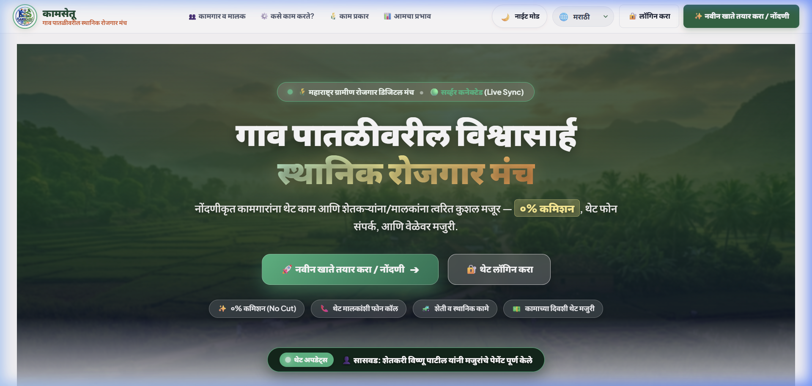
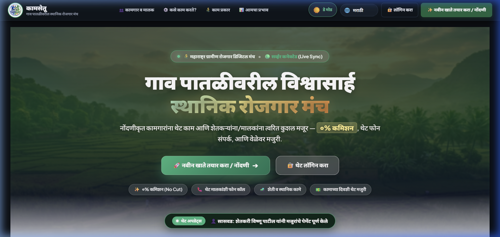
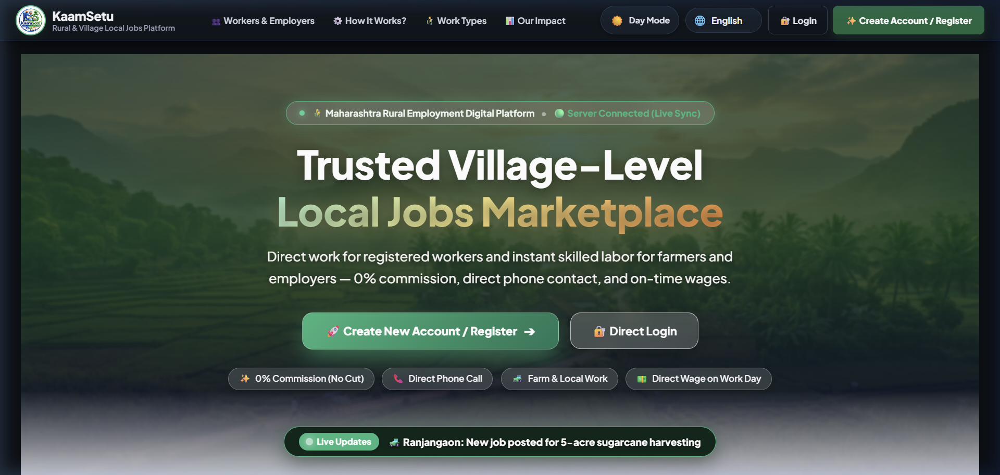
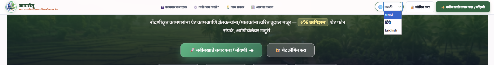
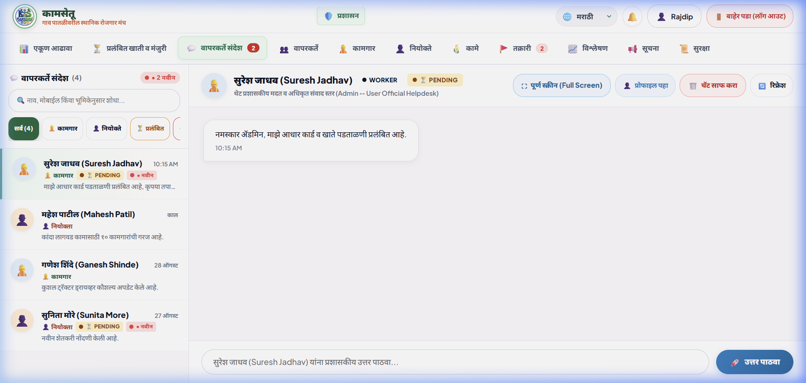

# 🌾 KaamSetu (कामसेतू) — Rural & Village Local Jobs Marketplace

<p align="center">
  
</p>

<p align="center">
  <strong>गाव पातळीवरील विश्वासार्ह स्थानिक रोजगार मंच • Rural & Village Hyper-Local Jobs Platform</strong>
</p>

<p align="center">
  <a href="#-key-features"></a>
  <a href="#-multilingual-support"></a>
  <a href="#-technology-stack"></a>
  <a href="#-technology-stack"></a>
  <a href="#-pwa--offline-readiness"></a>
</p>

---

## 📖 About KaamSetu

**KaamSetu (कामसेतू)** is a dedicated, hyper-local two-sided marketplace engineered specifically for rural India and agricultural economies (starting in Maharashtra's Pune rural belt — Shirur, Ranjangaon, Saswad, Chakan, Baramati, and beyond).

Rural workers frequently lose wages to informal labor middlemen (*Mukkadams*) or wait hours at road crossings (*Chowks*) searching for daily work. Simultaneously, farmers and rural business owners struggle with critical labor shortages during harvesting windows (sugarcane, onions, soybean). 

**KaamSetu bridges this gap digitally:**
- **0% Commission (Zero Cut):** 100% of the wage goes straight from employer to worker in cash or direct UPI.
- **Direct Phone Calls:** No complex middleman bureaucracy; verified employers and workers connect directly.
- **Hyper-Local Matching:** Matches workers within 5 to 25 km of their home village to eliminate costly daily migration.
- **Same-Day Wage Transparency:** Clear, pre-agreed daily wage rates and transparent terms before accepting work.

---

## 🖼️ Application Showcase

### 1. Atmospheric Landing Page (Day & Night Mode)
Modern responsive landing view with rural scenic imagery, real-time activity ticker, and village wage calculator.

| ☀️ Day Mode | 🌙 Night Mode |
|:---:|:---:|
|  |  |

---

### 2. Global Multilingual System (English, हिंदी, मराठी)
Switch the **entire platform** (all pages, dashboards, navigation, forms, and popups) with a single click.



---

### 3. Executive Admin Governance & Real-Time Messaging
Comprehensive oversight for user approvals, dispute resolution, job moderation, and direct chat communication.

| 📊 Admin KPI Dashboard & Quick Actions | 💬 Real-Time Admin ↔ User Messaging |
|:---:|:---:|
|  |  |

---

## ✨ Key Features

### 🌐 1. Global Multilingual Engine (i18n)
- **Three Supported Languages:** Full native translations for **Marathi (मराठी)**, **Hindi (हिंदी)**, and **English**.
- **Global Scope:** Toggling the language selector translates headers, hero sections, interactive calculators, dual-role dashboards, forms, toasts, and validation popups.
- **State Persistence:** Language choice persists in `localStorage` across page reloads, session navigations, and logins.

### 👥 2. Dual Roles with 1-Click Role Switching
- **Worker (कामगार / Job Seeker):** Browse nearby farm, tractor, construction, and helper jobs; filter by taluka and category; receive direct calls from employers; track daily applications.
- **Employer / Provider (शेतकरी / मालक):** Post job openings in under 30 seconds, review applicants, track hire status, and directly call workers.
- **Seamless Role Switching:** Users holding dual profiles can switch between **Worker** and **Provider** views instantly from the header without re-logging.

### 🛡️ 3. Administrative Governance & Moderation
- **Pending Registration Approval Queue:** Prevents fraudulent accounts. New accounts are verified and manually approved by Admin.
- **Dispute Resolution Center:** Bilateral reporting for No-Shows, wage disputes, or terms violations with rapid administrative actions.
- **Immutable Audit Trail:** Logs security events, role switches, and administrative actions with IP and timestamp tracing.
- **Bidirectional In-App Messaging:** Admin can directly message any worker or employer to assist with KYC, onboarding, or grievance redressal.

### 🧮 4. Interactive Village Wage & Worker Estimator
- Instant market wage calculator for rural villages (Shirur, Ranjangaon, Saswad, Chakan, Shikrapur, Baramati).
- Provides estimated daily wages, count of available registered workers, and average response times for Agriculture, Tractor Driving, Construction, and Helper work.

### 🌗 5. Day Mode & Night Mode (Theme Engine)
- Ergonomic light and dark themes crafted for both bright outdoor agricultural field conditions and low-light night viewing.
- High-contrast color tokens and instant theme initialization to prevent Flash of Unstyled Content (FOUC).

### 📱 6. PWA & Offline Resilience
- Progressive Web App (PWA) with `manifest.json` and `service-worker.js`.
- Installable on mobile home screens as a native application.
- SafeStorage offline caching ensures users can view saved contacts and job listings even with intermittent rural 2G/3G connectivity.

---

## 🏗️ System Architecture

```mermaid
graph TD
    User([Rural Worker / Farmer / Admin]) -->|Browser / Mobile PWA| UI[Frontend SPA: HTML5 + Vanilla JS + CSS Tokens]
    
    subgraph Frontend Core
        UI --> I18N[i18n Engine: Marathi / Hindi / English]
        UI --> Theme[Theme Manager: Day / Night Mode]
        UI --> State[State & SafeStorage: Offline Cache]
        UI --> APIClient[API Client: REST + Auth Bearer]
    end

    APIClient -->|HTTPS / REST API| SpringBoot[Spring Boot 3.2.3 Backend API]

    subgraph Backend Core
        SpringBoot --> Security[Spring Security + JWT Authentication]
        SpringBoot --> AuthMod[Auth & Registration Module]
        SpringBoot --> JobMod[Job Lifecycle & Moderation Module]
        SpringBoot --> AdminMod[Admin Governance & Audit Module]
        SpringBoot --> MsgMod[Persistent Bidirectional Messaging]
        SpringBoot --> EmailSvc[Google SMTP Email OTP / Mock Fallback]
    end

    Backend Core --> Database[(H2 Persistent DB / PostgreSQL)]
```

---

## 💻 Technology Stack

| Layer | Technologies Used |
|---|---|
| **Frontend** | HTML5 Semantic, Modern Vanilla JavaScript (ES6+), Vanilla CSS Custom Properties (Tokens), PWA Service Worker |
| **Styling & Theme** | Design System Tokens (`design-system.css`, `components.css`), Light/Dark Mode Palette, Glassmorphism, Mobile-First Responsive Grid |
| **Internationalization** | Custom Reactive `I18nManager` (`js/i18n.js`) with complete dictionary mappings for English, Hindi, and Marathi |
| **Backend** | Java 17, Spring Boot 3.2.3, Spring Data JPA, Spring Security, Spring Validation |
| **Authentication** | Stateless JWT (HMAC-SHA256), BCrypt Password Encryption, OTP Verification |
| **Database** | H2 Database Engine (In-Memory & File Persistence), PostgreSQL Production Ready |
| **Testing** | JUnit 5, Mockito, Spring Boot Test (250+ Automated Unit & Integration Tests) |
| **Deployment** | Docker, Docker Compose, Nginx, Windows Batch Launchers |

---

## 📁 Repository Directory Structure

```text
KaamSetu/
├── backend/                       # Spring Boot 3.2 Backend Service
│   ├── src/main/java/com/kaamsetu/
│   │   ├── modules/auth/          # Authentication, JWT, and User Entity
│   │   ├── modules/job/           # Jobs, Categories, and Wage Estimation
│   │   ├── modules/admin/         # Admin Governance, KPI & Audit Log Engine
│   │   ├── modules/message/       # Bidirectional Admin-User Chat Service
│   │   └── modules/notification/  # SMS / Email Notification Dispatcher
│   ├── src/main/resources/
│   │   └── application.yml        # Multi-profile Database & SMTP Config
│   └── pom.xml                    # Maven Dependency Management
├── css/
│   ├── design-system.css          # Design tokens, color palette, typography & theme overrides
│   └── components.css             # Modals, hero cards, navigation, forms & responsive UI
├── js/
│   ├── i18n.js                    # Global multilingual translation manager & dictionaries
│   ├── app.js                     # Main application router, dashboards & interactive views
│   ├── api.js                     # REST API Client communicating with Spring Boot
│   ├── auth.js                    # Session persistence, login, registration & role switcher
│   ├── state.js                   # Client-side reactive state & data store
│   └── security.js                # Input sanitization & client security guards
├── docs/
│   └── screenshots/               # Application demo screenshots for GitHub
├── Logo.png                       # Official KaamSetu Logo
├── index.html                     # Universal Single-Page Application entry point
├── manifest.json                  # PWA Manifest configuration
├── service-worker.js              # PWA offline asset caching
├── start_kaamsetu.bat             # One-click Windows startup script (Backend + Browser)
├── push_to_github.bat             # Automated Git push script
└── docker-compose.yml             # Containerized deployment stack
```

---

## 🚀 Quick Start Guide

### Option 1: One-Click Startup (Windows)
Double-click `start_kaamsetu.bat` in the root directory. This script:
1. Validates Java 17 and Maven installations.
2. Builds and starts the Spring Boot backend server on `http://localhost:8080`.
3. Launches the web client directly in your default browser.

---

### Option 2: Manual Setup

#### 1. Backend Server (Spring Boot)
```bash
cd backend
# Run on Windows
mvnw.cmd spring-boot:run

# Run on Linux/macOS
./mvnw spring-boot:run
```
*Backend runs on `http://localhost:8080`.*
*H2 Database Console available at `http://localhost:8080/h2-console`.*

#### 2. Frontend Client
Simply open `index.html` in your web browser, or serve it with any local static HTTP server:
```bash
# Using Python
python -m http.server 3000

# Using Node.js npx
npx serve .
```
*Frontend connects automatically to `http://localhost:8080/api/v1` with offline cache fallback.*

---

## 🔑 Demo & Test Accounts

You can test all three perspectives using pre-configured demo profiles:

| Role | Username | Password | Key Capabilities |
|---|---|---|---|
| **Super Admin** | `admin` | `admin123` | Executive KPI overview, user KYC approvals, dispute resolution, broadcast alerts |
| **Worker (कामगार)** | `santosh` | `worker123` | View nearby farm jobs, wage calculator, apply for work, view earnings |
| **Employer (नियोक्ता)** | `mahesh` | `provider123` | Post agricultural jobs, review applicants, hire workers, call directly |

---

## 📡 REST API Overview

| Method | Endpoint | Description | Access |
|---|---|---|---|
| `GET` | `/api/v1/public/stats` | Real-time counts of workers, employers, and villages | Public |
| `POST` | `/api/v1/auth/login` | Username/password authentication returning JWT | Public |
| `POST` | `/api/v1/auth/register` | Register new Worker or Provider with OTP | Public |
| `GET` | `/api/v1/jobs` | Retrieve filtered job listings (by taluka, category) | Authenticated |
| `POST` | `/api/v1/jobs` | Post new agricultural or rural job requirement | Employer / Admin |
| `GET` | `/api/v1/admin/pending-users` | List newly registered accounts awaiting approval | Admin |
| `POST` | `/api/v1/admin/users/{id}/approve` | Approve user account and grant platform access | Admin |
| `GET` | `/api/v1/admin/conversations` | Fetch all user support chat threads | Admin |
| `POST` | `/api/v1/messages/send` | Send persistent chat message | Worker / Provider / Admin |

---

## 🧪 Testing & Verification

The project includes an extensive automated test suite covering:
- **RBAC Security Access Gate Tests:** Verifies unauthenticated users cannot access administrative endpoints.
- **Bidirectional Messaging Tests:** Validates real-time persistence and unread badge counters.
- **Language Synchronization Tests:** Validates dictionary integrity across English, Hindi, and Marathi.

To run all backend tests:
```bash
cd backend
mvn test
```

---

## 🤝 Contributing

Contributions are warmly welcome to make KaamSetu even more impactful for rural communities:
1. Fork the Project
2. Create your Feature Branch (`git checkout -b feature/NewRuralFeature`)
3. Commit your Changes (`git commit -m 'Add support for additional agricultural categories'`)
4. Push to the Branch (`git push origin feature/NewRuralFeature`)
5. Open a Pull Request

---

## 📄 License

Distributed under the **MIT License**. See `LICENSE` for more information.

---

<p align="center">
  Made with ❤️ for Rural India • महाराष्ट्राच्या ग्रामीण अर्थव्यवस्थेला डिजिटल बळ
</p>
