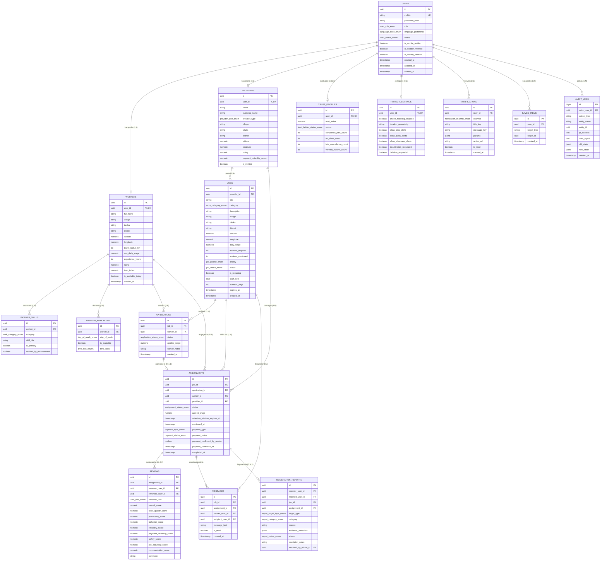
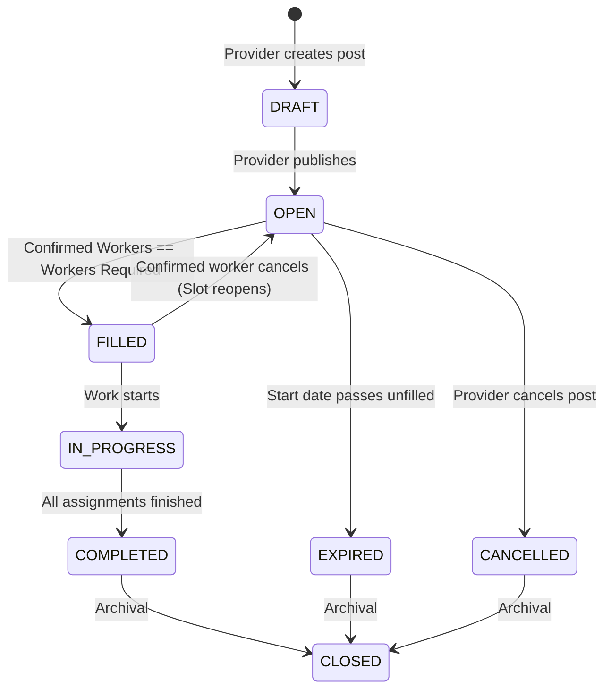
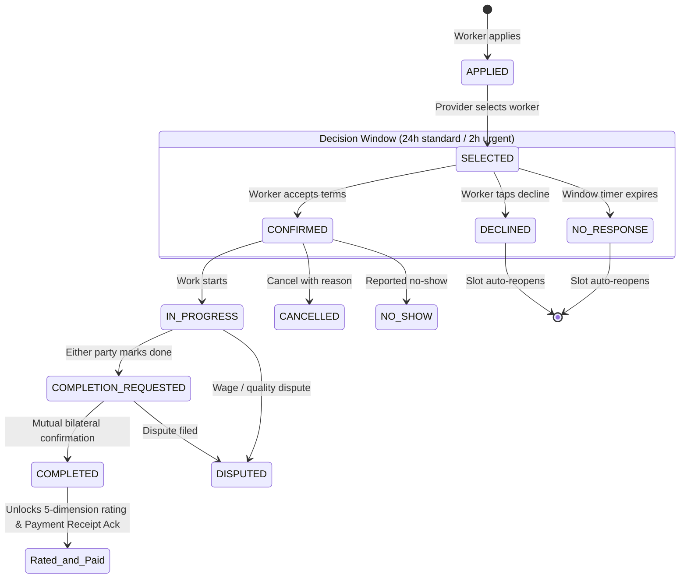

# 🌾 KaamSetu (कामसेतू) — Entity-Relationship Diagram (ERD) & Schema Architecture
## Phase 2: Domain Modeling & Relational Schema Specification

---

## 1. High-Level Entity-Relationship Diagram (Mermaid)

---

## 2. Dual State Machine Architectural Diagrams

### 2.1 Job Recruitment State Machine (`job.status`)
Governs the public posting and capacity availability of the job post.

### 2.2 Worker Engagement State Machine (`assignment.status`)
Governs individual worker recruitment, confirmation timer, bilateral progress, and completion.

---

## 3. Relational Foreign Key Integrity & Cascade Rules

| Child Table | Foreign Key Column | Parent Table | On Delete Rule | Rationale |
| :--- | :--- | :--- | :--- | :--- |
| `workers` | `user_id` | `users(id)` | **CASCADE** | Worker profile cannot exist without a core user account. |
| `worker_skills` | `worker_id` | `workers(id)` | **CASCADE** | Skills belong directly to the worker entity. |
| `worker_availability` | `worker_id` | `workers(id)` | **CASCADE** | Availability calendar belongs directly to the worker entity. |
| `providers` | `user_id` | `users(id)` | **CASCADE** | Provider profile cannot exist without a core user account. |
| `jobs` | `provider_id` | `providers(id)` | **RESTRICT** | Provider accounts with job history cannot be deleted without audit preservation. |
| `applications` | `job_id` | `jobs(id)` | **CASCADE** | Unprocessed applications are cleaned if a draft job is purged. |
| `applications` | `worker_id` | `workers(id)` | **CASCADE** | Applications belong to the applicant worker. |
| `assignments` | `job_id` | `jobs(id)` | **RESTRICT** | Immutable work records cannot be orphaned. |
| `assignments` | `worker_id` | `workers(id)` | **RESTRICT** | Protects active/completed work engagement history. |
| `assignments` | `provider_id` | `providers(id)` | **RESTRICT** | Protects active/completed work engagement history. |
| `reviews` | `assignment_id` | `assignments(id)`| **CASCADE** | Ratings are attached directly to verified completed assignments. |
| `reviews` | `reviewer_user_id` | `users(id)` | **RESTRICT** | Reviewer attribution is preserved for trust score integrity. |
| `trust_profiles` | `user_id` | `users(id)` | **CASCADE** | Trust profile is a direct extension of user identity. |
| `moderation_reports`| `reporter_user_id` | `users(id)` | **RESTRICT** | Compliance records require audit integrity. |
| `notifications` | `user_id` | `users(id)` | **CASCADE** | User inbox is cleaned on account purging. |
| `messages` | `sender_user_id` | `users(id)` | **RESTRICT** | Chat transcript integrity is preserved for safety investigations. |
| `privacy_settings` | `user_id` | `users(id)` | **CASCADE** | Privacy settings belong to user account. |
| `audit_logs` | `actor_user_id` | `users(id)` | **SET NULL** | Immutable audit logs persist even if actor is anonymized. |
